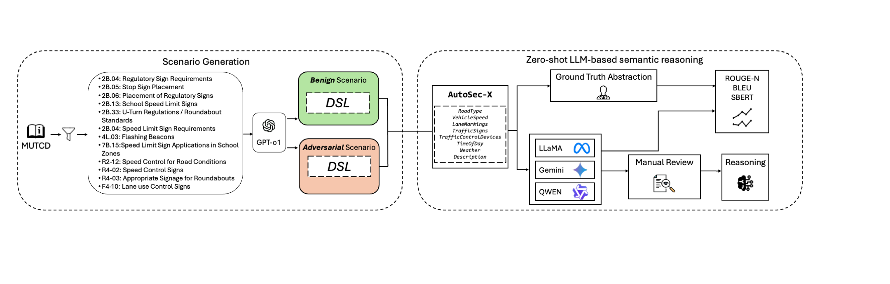

# WIP: From Detection to Explanation: Using LLMs for Adversarial Scenario Analysis in Vehicles

> Published at the **3rd USENIX Symposium on Vehicle Security and Privacy (VehicleSec 2025)** — Seattle, WA, August 11–12, 2025

This project uses Large Language Models (LLMs) with zero-shot chain-of-thought (CoT) prompting to detect and explain adversarial manipulations in autonomous vehicle (AV) perception. Rather than relying on labeled training data, the framework encodes driving scenarios in a Domain-Specific Language (DSL) and grounds LLM reasoning in the Manual on Uniform Traffic Control Devices (MUTCD) to distinguish benign sensor errors from adversarial attacks.

---

## Framework



The pipeline has two stages:
1. **Scenario Generation** — GPT-4 generates 40 MUTCD-grounded driving scenarios (the AutoSec-X dataset), each labeled as benign or adversarial.
2. **Zero-shot LLM Reasoning** — LLMs process each scenario in DSL format using CoT prompting. Outputs are evaluated against ground truth using ROUGE-N, BLEU, and SBERT metrics.

---

## Dataset: AutoSec-X

`data/scenarios.json` contains 40 driving scenarios, each with:

| Field | Description |
|---|---|
| `id` | Scenario identifier |
| `RoadType` | Road classification (e.g., Highway, Urban Roundabout) |
| `Speed` | Vehicle speed in mph |
| `LaneMarkings` | Observed lane markings |
| `TrafficSigns` | Signs present in the scenario |
| `TrafficControlDevices` | Additional traffic control devices |
| `TimeOfDay` | Lighting condition |
| `Weather` | Weather condition |
| `Description` | Natural language scenario description |
| `ground_truth` | Expert explanation referencing MUTCD sections |

All 40 scenarios describe inconsistencies detectable under MUTCD guidelines (i.e., all ground truth labels are positive — inconsistency detected).

---

## Models Evaluated

| Family | Models |
|---|---|
| **Gemini** | gemini-1.5-flash, gemini-1.5-flash-8b, gemini-1.5-pro, gemini-2.0-flash-exp |
| **LLaMA** | Llama-3.2-1B-Instruct, Llama-3.2-3B-Instruct, Llama-3.2-8B-Instruct |
| **Qwen** | Qwen2.5-7B-Instruct-1M, Qwen2.5-14B-Instruct-1M |
| **Mistral** | mistral (see `notebooks/mistral.ipynb`) |
| **OpenAI** | gpt-3.5-turbo-instruct, gpt-4o, gpt-4o-mini, o1, o3-mini |

---

## Results

### Inconsistency Detection Accuracy

| Model | Accuracy |
|---|---|
| gemini-1.5-flash | **92.5%** |
| gemini-1.5-pro | 87.5% |
| gemini-2.0-flash-exp | 87.5% |
| Llama-3.2-8B-Instruct | 87.5% |
| gemini-1.5-flash-8b | 82.5% |
| Qwen2.5-7B-Instruct | 82.5% |
| Qwen2.5-14B-Instruct | 82.5% |
| Llama-3.2-1B-Instruct | 55.0% |
| Llama-3.2-3B-Instruct | 50.0% |

### Explanation Quality (vs. Ground Truth)

| Model | ROUGE-1 | ROUGE-L | SBERT |
|---|---|---|---|
| gemini-1.5-flash | **0.342** | **0.249** | 0.680 |
| gemini-1.5-pro | 0.331 | 0.245 | **0.691** |
| gemini-2.0-flash-exp | 0.320 | 0.235 | 0.677 |
| gemini-1.5-flash-8b | 0.309 | 0.216 | 0.671 |
| Llama-3.2-1B-Instruct | 0.216 | 0.148 | 0.618 |
| Llama-3.2-3B-Instruct | 0.180 | 0.124 | 0.530 |
| Llama-3.2-8B-Instruct | 0.142 | 0.100 | 0.477 |
| Qwen2.5-7B-Instruct | 0.150 | 0.094 | 0.281 |
| Qwen2.5-14B-Instruct | 0.145 | 0.092 | 0.281 |

Gemini models consistently outperform open-source alternatives in both detection accuracy and explanation quality. Notably, larger Gemini models frequently cite specific MUTCD sections in their reasoning.

---

## Setup

**Requirements:** Python 3.10+

Install dependencies:
```bash
pip install google-generativeai openai transformers torch \
    pandas matplotlib seaborn scikit-learn \
    bert-score rouge-score sentence-transformers nltk
```

**API keys:** Each evaluation notebook expects a config file or environment variable with the relevant API key (e.g., `GOOGLE_API_KEY`, `OPENAI_API_KEY`, HuggingFace token for LLaMA).

---

## Workflow

Run the notebooks in the following order:

| Step | Notebook | Description |
|---|---|---|
| 1 | `notebooks/ScenariosGeneration.ipynb` | Generate AutoSec-X scenarios using GPT-4 and MUTCD |
| 2 | `notebooks/create_results_file.ipynb` | Initialize the results CSV template |
| 3a | `notebooks/gemini.ipynb` | Evaluate Gemini models |
| 3b | `notebooks/openai.ipynb` | Evaluate OpenAI models |
| 3c | `notebooks/llama.ipynb` | Evaluate LLaMA models (HuggingFace) |
| 3d | `notebooks/qwen.ipynb` | Evaluate Qwen models (HuggingFace) |
| 3e | `notebooks/mistral.ipynb` | Evaluate Mistral models |
| 4 | `notebooks/evaluation.ipynb` | Aggregate and inspect model outputs |
| 5a | `notebooks/accuracy.ipynb` | Compute detection accuracy per model |
| 5b | `notebooks/metrics.ipynb` | Compute ROUGE, BLEU, and SBERT scores |
| 5c | `notebooks/correlation_analysis.ipynb` | Correlation analysis across models |

All data files (input and output) are stored in `data/`.

---

## Repository Structure

```
VehicleSec25_LLM_Reasoning/
├── assets/
│   └── framework.png
├── data/
│   ├── scenarios.json          # AutoSec-X dataset (40 scenarios)
│   ├── results.csv             # Raw LLM outputs
│   ├── Accuracy.csv            # Per-scenario detection labels
│   ├── latency_results.csv     # Inference latency per model
│   └── modelsVsGt_averages.csv # Aggregated metric scores
├── notebooks/
│   ├── ScenariosGeneration.ipynb
│   ├── create_results_file.ipynb
│   ├── gemini.ipynb
│   ├── openai.ipynb
│   ├── llama.ipynb
│   ├── qwen.ipynb
│   ├── mistral.ipynb
│   ├── evaluation.ipynb
│   ├── accuracy.ipynb
│   ├── metrics.ipynb
│   └── correlation_analysis.ipynb
└── README.md
```

---

## Citation

```bibtex
@inproceedings{fernandez2025detection,
  title     = {{WIP}: From Detection to Explanation: Using {LLMs} for Adversarial Scenario Analysis in Vehicles},
  author    = {Fernandez, David and MohajerAnsari, Pedram and Kokenoz, Cigdem and Salarpour, Amir and Li, Bing and Pes\'{e}, Mert D.},
  booktitle = {Proceedings of the 3rd USENIX Symposium on Vehicle Security and Privacy (VehicleSec)},
  year      = {2025},
  address   = {Seattle, WA, USA},
  publisher = {USENIX Association},
  isbn      = {978-1-939133-49-6},
  url       = {https://www.usenix.org/conference/vehiclesec25}
}
```
